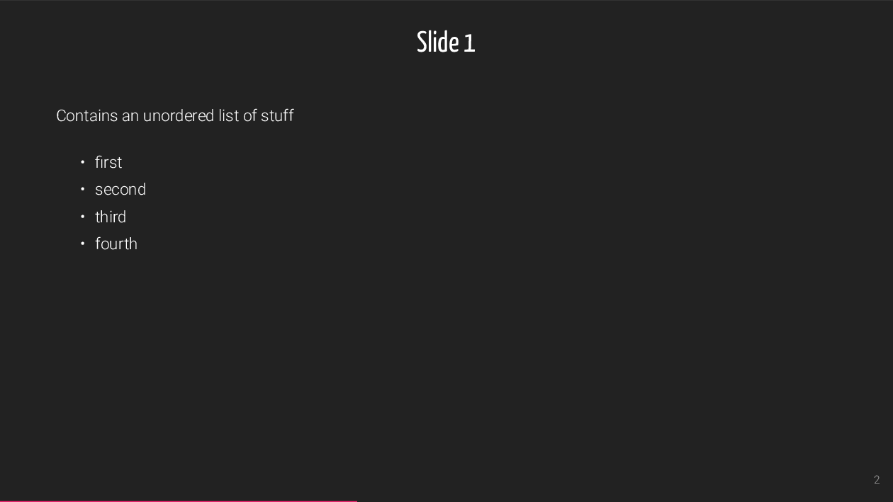
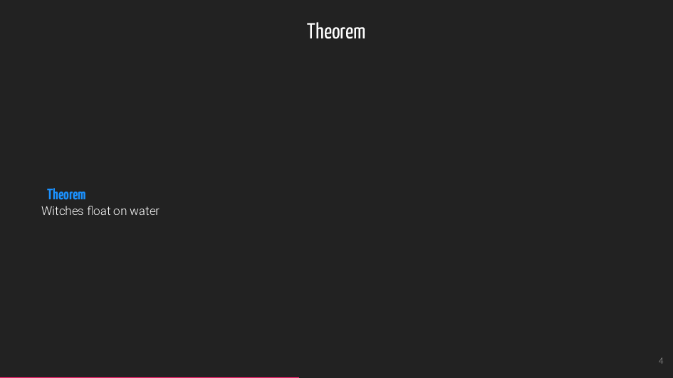
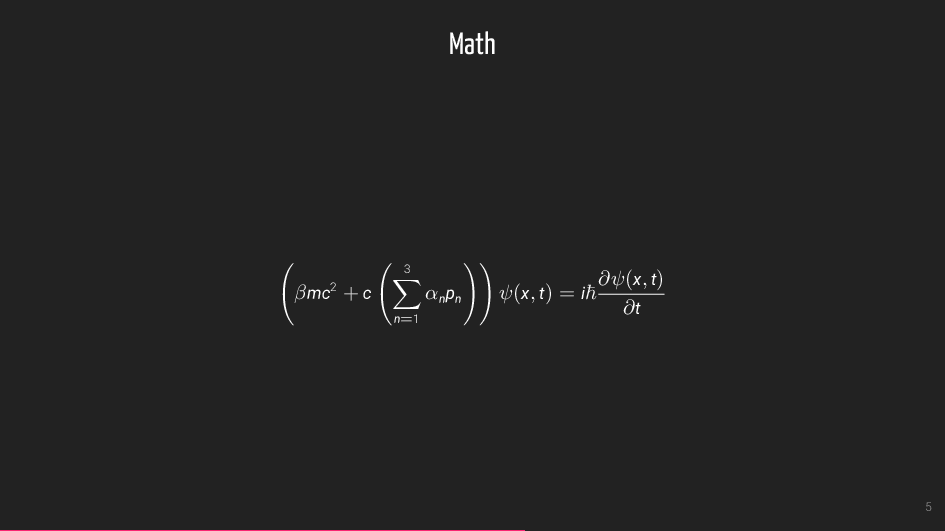
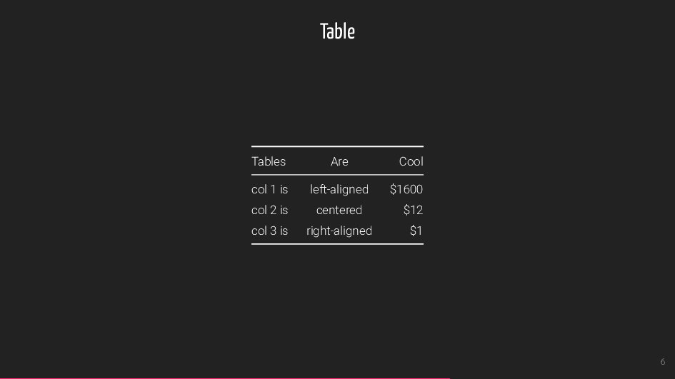
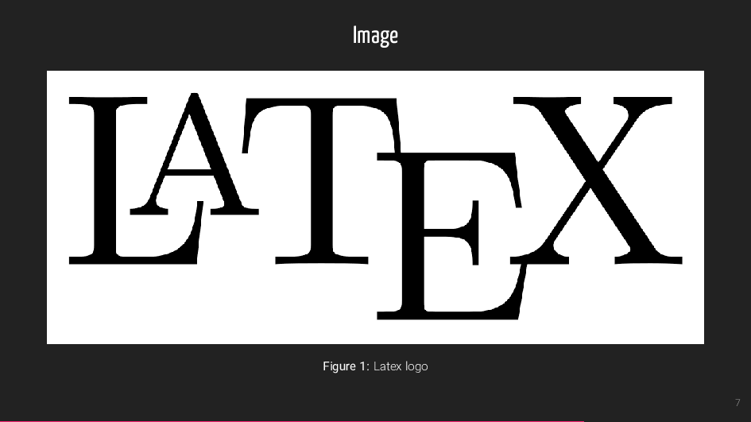
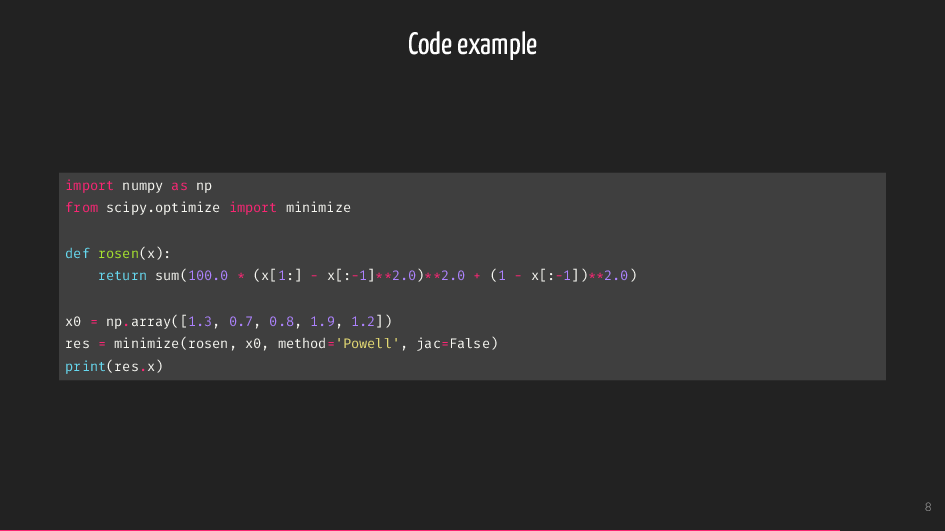
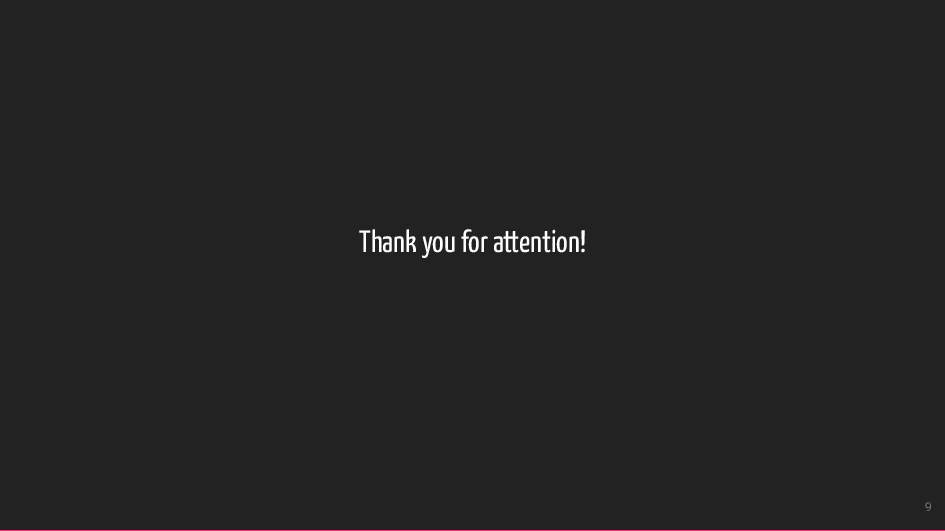

# cookiecutter-mdbeamer

This is a [cookiecutter] template for a quickly and comfortably
creating [beamer] presentations without all the tedious typing
associated with [LaTeX].

The slides contents are prepared using [markdown] which minimizes
the typing and then the pdf slides are build through an
automated process first using [pandoc] to convert `.md` to `.tex`.
Then `.tex` is converted to `.pdf` through [latexmk] using [luatex]
as the [LaTeX] engine.


## Style

The appearance is largely based on the [metropolis theme](https://github.com/matze/mtheme)
however some of the color and font schemes are customized. To take full advantage
of the modified theme install the two following fonts:

- [Yanone Kaffeesatz](http://yanone.de/fonts/kaffeesatz/) - used for the titles and structure elements
- [roboto](https://www.ctan.org/tex-archive/fonts/roboto) - slide contents

By syntax highlighting is using the [minted](https://ctan.org/tex-archive/macros/latex/contrib/minted/)
package and therefore requires [Python](https://www.python.org/) and [pygments](http://pygments.org/)
to work properly.


## Usage

First make sure you have the following dependencies installed:

- [GNU make](https://www.gnu.org/software/make/)
- [pandoc]
- [LaTeX]
- [luatex]
- [latexmk]

- [cookiecutter]
- [pygments]

Install [cookiecutter] and:

```bash
$ cookiecutter git@github.com:lmmentel/cookiecutter-mdbeamer.git
```

After modifying the `.md` file with the slide contents simply type

```bash
make pdf
```

and the slides should be built in the `build` directory.


### Options

A few selected options are available to to further customize the appearance:

- `aspectratio` - aspect ratio of the slides, allowed values are: `1610` for 16:10, `169` for 16:9, `149` for 14:9, `141` for 1.41:1, `54` for 5:4, `43` for 4:3 and `32` for 3:2
- `fontsize` - size of the document font, default `10pt`

## Example

The example slides are avaialble also as a [pdf](example/slides.pdf).












[beamer]: https://en.wikipedia.org/wiki/Beamer_(LaTeX)
[cookiecutter]: https://cookiecutter.readthedocs.io/en/latest/installation.html
[LaTeX]: https://www.latex-project.org/
[latexmk]: https://www.ctan.org/pkg/latexmk/
[luatex]: http://www.luatex.org/
[markdown]: https://daringfireball.net/projects/markdown/
[pandoc]: https://pandoc.org/
[pygments]: http://pygments.org/