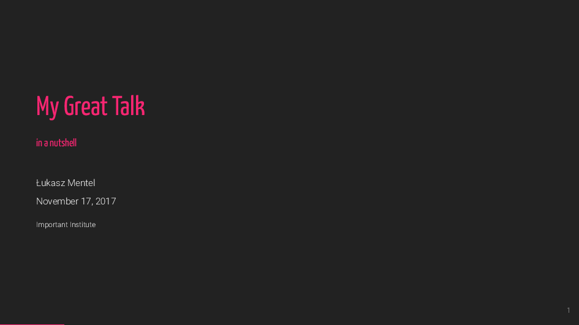
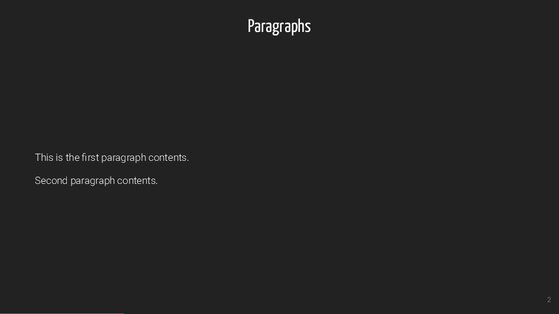
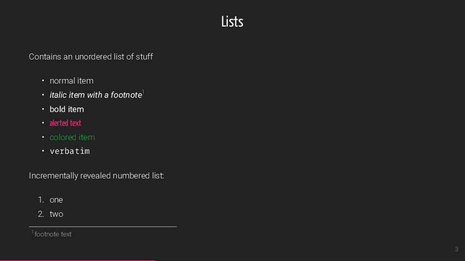

# cookiecutter-mdbeamer


A cookicutter template for a presentation using 

- [markdown](https://daringfireball.net/projects/markdown/)
- [pandoc](https://pandoc.org/)
- [luatex](http://www.luatex.org/)
- [latexmk](https://www.ctan.org/pkg/latexmk/)
- [beamer](https://en.wikipedia.org/wiki/Beamer_(LaTeX))
- [metropolis theme](https://github.com/matze/mtheme)

The appearance is modified and you need to install the following fonts

- [Yanone Kaffeesatz](http://yanone.de/fonts/kaffeesatz/)
- [roboto](https://www.ctan.org/tex-archive/fonts/roboto)


## Usage

Install [cookiecutter](https://cookiecutter.readthedocs.io/en/latest/installation.html) and:

```bash
$ cookiecutter git@github.com:lmmentel/cookiecutter-mdbeamer.git
```

## Example

The example slides are avaialble also as a [pdf](example/slides.pdf).






